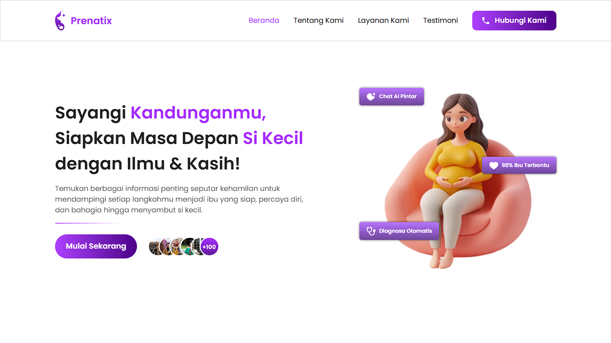

# 🤰 Prenatix - Website Edukasi Ibu Hamil

---

## 🩺 Deskripsi

**Prenatix** adalah sebuah website edukasi yang dirancang khusus untuk memberikan informasi lengkap dan terpercaya bagi para ibu hamil.  
Website ini menyajikan berbagai konten edukasi, tips kesehatan, informasi perkembangan janin, hingga konsultasi ringan yang membantu calon ibu memahami proses kehamilan dengan lebih baik.

Dengan desain yang **user-friendly** dan interaktif, Prenatix bertujuan untuk memberikan pengalaman belajar yang nyaman, aman, dan menyenangkan bagi para penggunanya.

Prenatix dikembangkan sebagai solusi digital bagi ibu hamil modern yang ingin mendapatkan informasi kesehatan secara **praktis, cepat, dan terpercaya** tanpa harus selalu bergantung pada kunjungan langsung ke tenaga medis.

---

## 🚀 Teknologi yang Digunakan
Website ini dibangun menggunakan **teknologi frontend modern** untuk memastikan performa optimal, kemudahan pengembangan, dan pengalaman pengguna yang baik.

| Teknologi  | Deskripsi Singkat |
|------------|-------------------|
|  **HTML** | Struktur utama website untuk menyajikan konten secara semantik dan terstruktur. |
|  **CSS** | Styling dasar untuk membuat tampilan website menarik dan konsisten. |
|  **JavaScript** | Bahasa pemrograman untuk membuat website interaktif dan dinamis. |
|  **Tailwind CSS** | Framework CSS modern untuk desain cepat, responsif, dan konsisten. |

---

## ✨ Fitur Utama

### 📚 1. Edukasi & Tips Kehamilan
Prenatix menyediakan berbagai konten edukasi terkait kehamilan, mulai dari perkembangan janin, nutrisi ibu hamil, hingga tips menjaga kesehatan mental dan fisik.  
Konten disajikan dengan **visual menarik** dan **bahasa yang mudah dipahami**.

---

### 🏥 2. Layanan Konsultasi Ringan
Pengguna dapat mengajukan pertanyaan seputar kehamilan atau kesehatan ibu hamil melalui fitur konsultasi ringan.  
Semua percakapan bersifat pribadi dan aman.

---

### 💬 3. Chatbot Edukasi
Fitur chatbot interaktif membantu pengguna mendapatkan jawaban cepat atas pertanyaan seputar kehamilan dan kesehatan ibu.  
Chatbot ini memberikan pengalaman belajar yang lebih personal dan responsif.

---

### 📝 4. Quiz Interaktif
Prenatix menyediakan quiz edukasi untuk menguji pengetahuan pengguna seputar kehamilan, nutrisi, dan perkembangan janin.  
Quiz ini dirancang menyenangkan dan mendidik sekaligus.

---

### 🎮 5. Game Edukasi
Pengguna dapat bermain game edukasi yang dirancang khusus untuk meningkatkan pemahaman mengenai kesehatan ibu dan janin secara interaktif dan menyenangkan.

---

### 📆 6. Edukasi Fase Kehamilan
Prenatix menampilkan panduan lengkap mengenai fase kehamilan dari trimester pertama hingga ketiga.  
Pengguna bisa memahami perkembangan janin dan perubahan tubuh ibu secara bertahap dengan mudah.

---

## 🎯 **Kenapa Prenatix?**
- Membantu ibu hamil mendapatkan **informasi terpercaya dan akurat** secara cepat dan mudah.  
- Menggabungkan **edukasi, konsultasi, dan hiburan edukatif** dalam satu platform.  
- Dibangun dengan teknologi **frontend modern, aman, dan responsif**, memastikan pengalaman pengguna yang nyaman di semua perangkat.

---

## 📝 **Penutup**
Prenatix hadir sebagai solusi digital untuk ibu hamil modern yang peduli dengan kesehatan diri dan bayi.  
Website ini cocok digunakan oleh semua calon ibu yang ingin **meningkatkan pengetahuan seputar kehamilan** dengan cara yang praktis dan interaktif.

---

🌐 [Kunjungi Prenatix](https://prenatix.vercel.app/)
